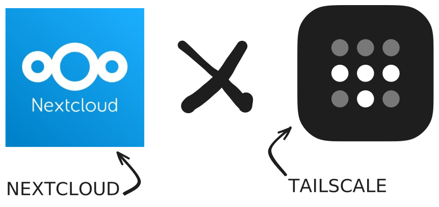

# Nextscale
In this project, Nextcloud uses technology from Tailscale so that users can access it locally from anywhere! We've made it as simple as possible to reduce the resources used.

## Documentation
- [Nextcloud](https://github.com/nextcloud/docker)
- [Tailscale](https://tailscale.com/kb/1282/docker)
